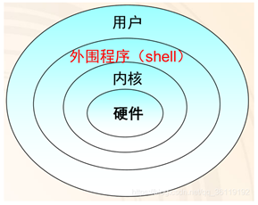

#### shell

> 我们经常会听到说获得某服务器的`shell`，就是指获得某个服务器的操作权限。我们学习`linux`时，经常会遇到`bash`，`bash`也是指的是某个服务器的权限。那么，这两者有什么区别和联系呢？
>
>  
> **1. shell**
>
> 我们先来看一些`Linux`系统的结构。
>
> 

> 
> 

>
> * `shell`介于用户和系统内核之间, 是用户和`Linux`内核之间的接口程序
>
> * `shell` 俗称壳（用来区别于核）。它类似于`DOS`下的`command.com`和后来的`cmd.exe`。
>
> * `shell`用来接收用户的输入，并且解释用户的命令。然后将其传给系统内核，内核再调用硬件来操作。
>
> * `shell` 是一个命令语言解释器（`command-language interpreter`）。拥有自己内建的 `shell` 命令集。此外，`shell`也能被系统中其他有效的`Linux` 实用程序和应用程序（`utilities and application programs`）所调用。
>
> 
> **2. shell 工作方式**
>
> 对用户来说，你不知道（或者可能不关心）一个命令是建立在`shell`内部还是一个单独的程序。
> 
> 而对于`shell`来说，键入的命令分两种：
> 
> * 内部命令： 比如打印当前工作目录命令（`pwd`）
> * 应用程序: Linux本身的应用程序、自建程序、别人的程序。
> 
>
> `shell` 首先检查命令是否是内部命令，不是的话再检查是否是一个应用程序，这里的应用程序可以是Linux本身的实用程序，比如`ls` `rm`，然后`shell`试着在搜索路径(`$PATH`)里寻找这些应用程序。**搜索路径是一个能找到可执行程序的目录列表**。如果你键入的命令不是一个内部命令并且在路径里没有找到这个可执行文件，将会显示一条错误信息。而如果命令被成功的找到的话，shell的内部命令或应用程序将被分解为系统调用并传给Linux内核
>
> 补充：
> * Linux本身的应用程序有哪些？
> > 比如文件系统中某个目录下的单独的程序: 比如拷贝命令（`cp`）和移除命令（`rm`）。这些并不都是
> 
> * 自建程序有哪些？
> > 比如我们自己写的构建程序`build.sh`
> 
> * 别人的程序有哪些？
> > 比如我们下载的`.deb`安装包
>
> 
> **3. Shell script**
>
> `Shell Script`指的是针对`shell`所写的脚本。我们将一些`shell`规定的语法与命令，再搭配正则表达式、管道命令与数据流重定向等功能，写成一个纯文本文件以达到我们想要的处理目的，再配以`.sh`的扩展名，这便是`Shell Script`了。
> 简言之，我们只有通过 `shell` 这个工具来解释我们的命令等请求，我们才能成功实现与计算机的交流，同时再搭配`Shell script`可以**批量处理命令**，我们就可以与计算机更优雅的交流哟！
>
> 
> **4. 多种类型的shell**
>
> 既然`shell`是解释命令的工具，那么这个工具可不可以多样化呢？不同的解释工具可不可以遵从不同的规则呢？
> 
> 这是必然的咯，何况是像`Linux`这种开源的好东西，怎么会缺乏多样性呢？！
> 
> 所以，我们就不难理解`Linux`中的`shell`有多种类型了吧，这其中最常用的几种是 `Bourne shell（sh）`、`Bourne Again shell(bash)` 和 `Debian Almquist Shell（dash）`。其中三种`shell`各有优缺点：
>
> * `sh`
> > `sh(Bourne shell)`是`UNIX`最初使用的`shell`，并且在每种`UNIX`上都可以使用。`Bourne shell`在`shell`编程方面相当优秀，但在处理与用户的交互方面做得不如其他几种`shell`。
> > 
> > 名字中的玻恩`Bourne`就是这个`Shell`的作者。
> > 
> > `sh(Bourne shell)`最大的缺点在于它处理用户的输入方面。在 `sh(Bourne shell)` 里键入命令会很麻烦，尤其当你键入很多相似的命令时。而 `bash` 准备了几种特性使命令的输入变得更容易。
> > 
>
> * `bash`
> > `bash（GNU Bourne-Again Shell）`是最常用的一种`shell`，是当前大多数`Linux`发行版的默认`Shell`。
> > 
> > `bash`是`sh`的扩展，简称`Bash`，与`sh`完全向后兼容，并且在`sh`的基础上增加、增强了很多特性。
> > 
> > `bash`放在`/bin/bash` 中，它有许多特色，可以提供如命令补全、命令编辑和命令历史表等功能，有灵活和强大的编程接口，同时又有很友好的用户界面。
> >
> >
> > 所以我们通常会在脚本第一行写  `#!/bin/bash`  ，意思就是用 `/bin/bash` 去执行这个脚本。
> > 
> > 注：`Redhat`系列的 `Linux` 操作系统中的 `/bin/sh` 是 `/bin/bash` 的符号链接。所以，用 `sh` 执行脚本和 `bash` 执行脚本，效果是一样的。
> > 
>
> * `Dash` 只在`Debian`中
> > `dash (Debian Almquist Shell)`比Bash Shell小的多，符合POSIX标准.
> > `Debian`下默认使用的还是bash，只不过`sh`指向的是`dash`。
> > 
> > 也就是说，`Debian`中，若脚本第一行为`#!/bin/sh`，则我们使用命令：`sh  script_name.sh`  时是调用的`dash`去解释脚本
> >
> > 
> 
> **5. tty 、pty 和 pts**
> >
> > 这里再多说一点，说说我们经常看到的 `tty` 和 `pts` 。
> 
> > `tty`就是`linux`里面终端的意思，你每一个可以输入`shell`进行解析的当前框，就是终端。
> > `pts`是终端的一个实例化。
> > `pty`就是虚拟终端。
> 
> 

#### 我们用Ubuntu，所以都是`bash`

