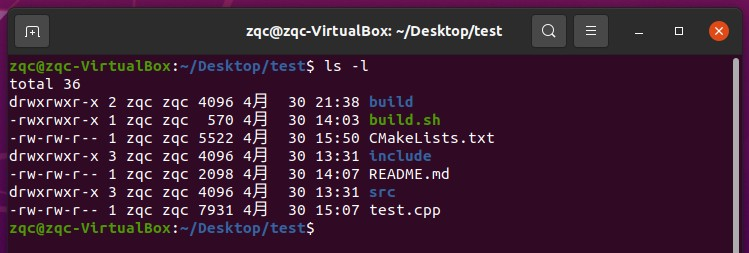
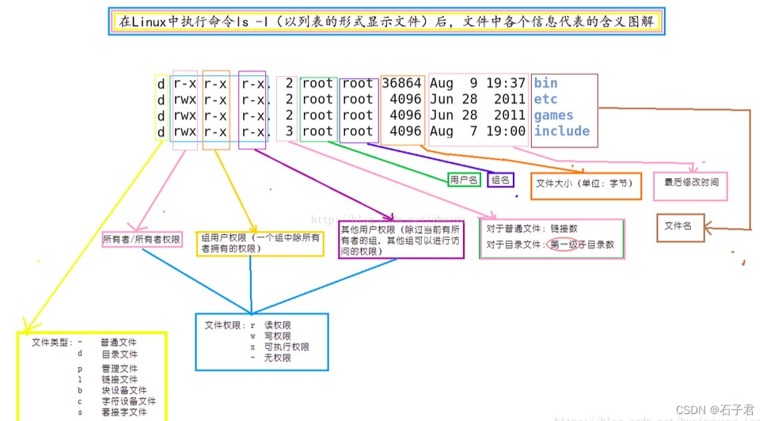
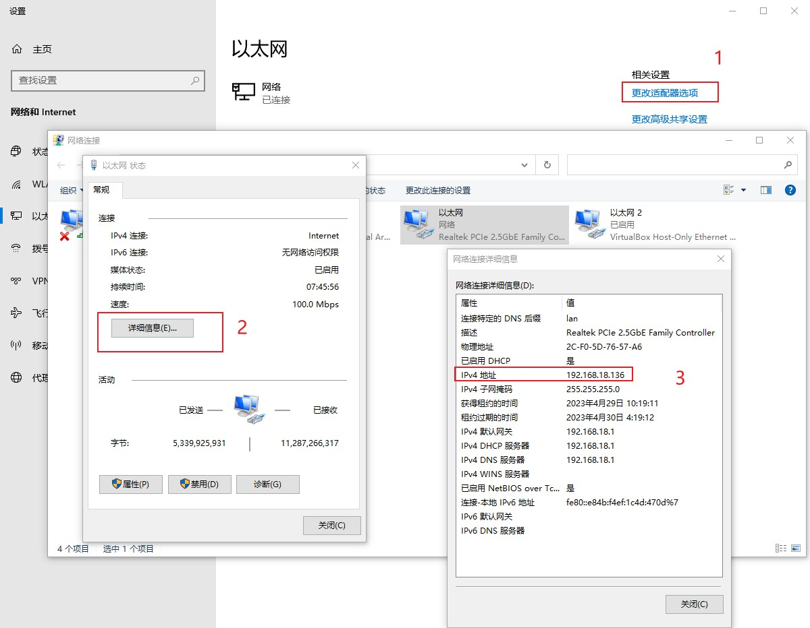
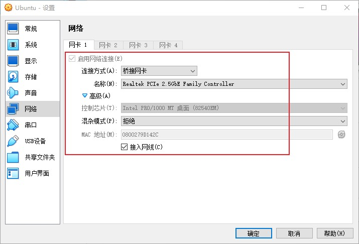
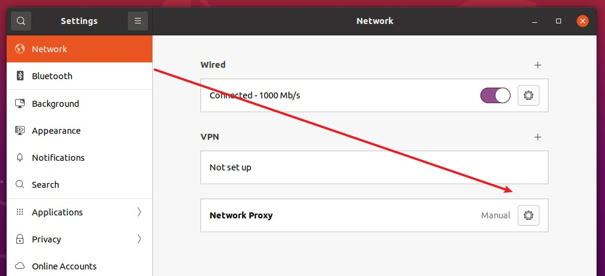
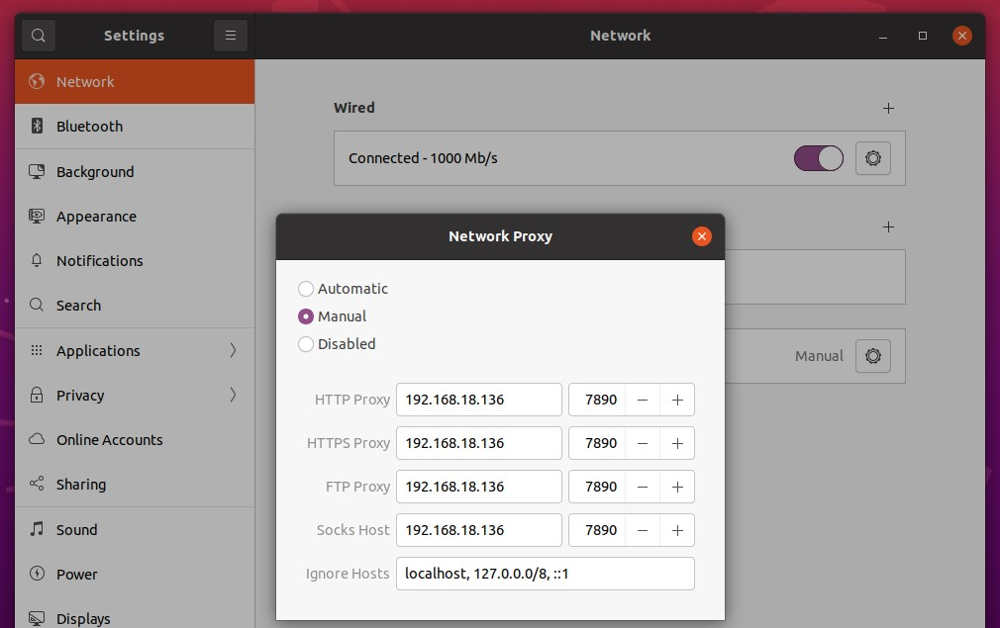
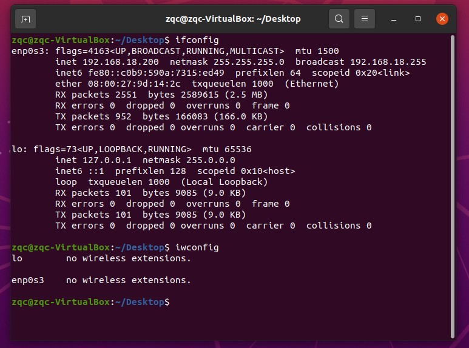

#### 常用`bash`变量

> `EDITOR`, `FCEDIT`: `bsah fc` 命令的缺省编辑器。
> 
> `HISTFILE`: 用于贮存历史命令的文件。
> 
> `HISTSIZE`: 历史命令列表的大小。
> 
> `HOME`: 当前用户的用户目录。
> 
> `OLDPWD`: 前一个工作目录。
> 
> `PATH`: `bash`寻找可执行文件的搜索路径。
> 
> `PS1`: 命令行的一级提示符。
> 
> `PS2`: 命令行的二级提示符。
> 
> `PWD`: 当前工作目录。
> 
> `SECONDS`: 当前`shell`开始后所流逝的秒


> `echo` 命令用于在终端设备上输出（显示/打印）字符串或变量的值。
> 例如
> ```bash
> echo $HOME
> 
> echo $PATH
>
> echo $PWD
>
> echo $HISTSIZE
> ```


#### 常用`bash`命令

>
> `help`: 显示bash内部命令的帮助信息。
> 
> `cd`: 改变当前工作目录。 
> 
> 注： ‘`~/`’指‘`/home/username/`’目录， 例如`$ cd /home/zqc/`
>
> `ls`: 列出当前路径下的文件
> 
> `exit`: 终止shell。
> 
> `export`: 使变量的值对当前shell的所有子进程都可见 。
> 
> `pwd`: 显示当前工作目录。或者`echo $PWD`
> 
> `alias`: 设置bash别名。
> 
> `unalias`: 删除已定义的别名。
> 
> `bg`: 使一个被挂起的进程在后台继续执行。
> 
> `fc`: 用来编辑历史命令列表里的命令。
> 
> `fg`: 使一个被挂起的进程在前台继续执行。
> 
> `kill`: 终止某个进程。
>
> `cp`: 拷贝命令
>
> `rm`: 移除命令
>
> `ifconfig`: 查看网卡信息
>
> `tar`、`zip`、`unzip`: 压缩与解压
> 
> `mkdir`: 创建文件夹
>
> `touch`: 创建文件
>
> `ls -l`: 查看当前路径下所有文件的信息
>
> `chmod`: 修改文件/目录(文件夹)的权限
>
> `tree`: 显示文件结构
>
> `!`: 行号
> 
> `!!`: 上一次命令
>
> 


#### 环境变量$PATH

> 了解ubuntu中环境变量文件/etc/profile、.profile、.bashrc、/etc/bash.bashrc之间的区别和联系
> 
> 添一般是在`~/.bashrc`中通过`export PATH=$PATH:`命令添加环境变量
> ```bash
> # 进入~/.bashrc
> sudo gedit ~/.bashrc
> 
> # 输入以下内容
> export  PATH=$PATH:/opt/xxx/bin
>
> # 保存 .bashrc的更改并退出
> ```
>
> 注意，有两种方式
> ```bash
> # 添加到PATH列表最后面
> export  PATH=$PATH:/opt/xxx/bin
> 
> # 添加到PATH列表最前面
> export  PATH=/opt/xxx/bin:$PATH
> ```
>
> 


#### 创建文件夹

> ```bash
> $ mkdir build   # 创建build文件夹
> $ mkdir ./build   
> 
> $ mkdir -p  build/gtest     # 递归创建目录，即使上级目录不存在，会按目录层级自动创建目录
> $ mkdir -p  ./build/gtest  
>
> # -p 确保目录名称存在,不存在的就建一个。
> # 好处就是一次可以创建多级文件夹，
> # 若xx文件夹不存在，则先创建xx文件夹，然后在xx文件夹下创建yy文件夹
> ```


#### 删除文件

> ```bash
> rm -rf filename # 删除文件filename
>
> rm -rf *        # 删除当前路径下所有文件
> ```
>
> 例如
> 
> ```bash
> $ rm -rf build  # 删除build文件夹，包括其中所有内容
>
> $ cd build
> $ rm -rf *      # 删除当前路径（build文件夹）中所有内容，但是build文件夹还在
> ```


#### `ls -l`查看文件权限

>
> <div align=center>
> 
> </div>
>
> 格式为
> ```html
> 文件类型和权限 数字 用户名 组名 文件大小 最后修改时间 文件名
> ```
>
> * 文件类型和权限
> 
> > * 第一个字符代表文件类型
> > > * `d`: 表示是一个目录(文件夹)
> > > * `-`: 表示这是一个普通的文件
> > > * `l`: 表示这是一个符号链接文件，实际上它指向另一个文件。
> > > * `b`、`c`：分别表示区块设备和其他的外围设备，是特殊类型的文件。
> > > * `s`、`p`：这些文件关系到系统的数据结构和管道，通常很少见到。
> > 
> > * 接下来每三个字符为一组权限，分为三组，依次代表
> > > * 所有者权限
> > > * 同组用户权限(用户组中除所有者以外)
> > > * 其它用户权限
> > 
> > * 每组权限的三个字符依次代表是否可读，是否可写，是否可执行
> > > * `r` 表示拥有读的权限
> > > * `w` 表示拥有写的权限
> > > * `x` 表示拥有可执行的权限
> > > * `-` 表示没有该权限
> > 
> > 
> > 下面举例说明
> > ```html
> > - rwx --- ---: 文件所有者对文件具有读取、写入和执行的权限。
> > 
> > - rwx r-- r--: 文件所有者具有读、写与执行的权限，其他用户则具有读取的权限。
> > 
> > - rw- rw- r-x: 文件所有者与同组用户对文件具有读写的权限，而其他用户仅具有读取和执行的权限。
> > 
> > d rwx --x --x: 目录所有者具有读写与进入目录的权限,其他用户近能进入该目录，却无法读取任何数据。
> > 
> > d rwx --- ---: 除了目录所有者具有完整的权限之外，其他用户对该目录完全没有任何权限。
> > ```
>
> * 数字(第11个字符：. 与selinux相关，有这个点表示selinux开启，没有这个点表示selinux关闭（不做了解）)
>
> <div align=center>
> 
> </div>
>

> 补充知识：
> 
> > Linux有两种用户：普通用户、超级（root）用户
> > 
> > * 超级用户：可以在linux系统下做任何事情，不受限制
> > 
> > * 普通用户：在linux下做有限的事情。
> > 
> > 超级用户的在终端的命令提示符是`#`，普通⽤用户的命令提⽰示符是`$`。
> > 

> 补充知识：
> 
> > 文件权限的基本种类（还有一些基本不用的权限不做说明）
> > 
> > 读（`r`）：`Read`
> > > * 对文件而言，具有读取文件内容的权限；
> > > * 对目录来说，具有浏览该目录信息的权限
> > > 
> > > 注意，对于目录而言，浏览的意思就说，r权限仅仅表示你有权限知道这个目录会有哪些内容，而不代表你就能cd到该目录进行工作，这是x权限才有的。
> > 
> > 
> > 写（`w`）：`Write`
> > > * 对文件而言，具有修改文件内容的权限；
> > > * 对目录来说具有删除移动目录内文件的权限
> > 
> > 
> > 执行（`x`）：`execute`
> > > * 对文件而言，具有执行文件的权限；
> > > * 对目录来说，具有进入(cd)目录的权限,
> > > 
> > > 事实上，对于目录来说，如果只有x权限，没有r权限的话，ls指令都执行不了，因为若没r权限，这个目录里的内容就不能读
> > 
> > 所以，一般`r`和`x`是同时存在的
> 

> 补充知识
>
> > 属主：该文件创建者或被指定的文件所属者
> > 
> > 属组：文件的所属组（在该组内的非属主用户对该文件拥有该属组权限）
> > 
> > 其他：其他用户，既不属于属主又不在属组的用户
> > 
> 

#### `chmod`设置权限（添加权限、取消权限）

> <font color="yellow">使用字母修改 "普通文件" 权限</font>
> 
> `r`、`w`、`x` 分别表示读、写、执行权限
> 
> `a` 代表全部用户（默认）：包括当前用户(所有者)、同组其他用户，其它用户
> `u` 代表所有者（当前用户）
> `g` 代表所有者所在用户组
> `o` 代表其他用户
> 
> ```bash
> # 给全部用户，添加执行权限
> chmod +x build.sh 
> 
> # 给全部用户，取消执行权限
> chmod -x build.sh 
> 
> 
> 
> # 给当前用户，添加执行权限
> chmod u+x build.sh 
> 
> # 给当前用户，取消执行权限
> chmod u-x build.sh 
> 
> 
> 
> # 给全部用户，添加读、执行权限
> chmod +rx build.sh 
> 
> # 给全部用户，取消读、执行权限
> chmod -rx build.sh 
> ```

> <font color="yellow">使用数字修改 "普通文件" 权限</font>
>
> `Linux` 系统中，文件的基本权限由 `9` 个字符组成，以 `rwxrw-r-x` 为例，我们可以使用数字来代表各个权限，各个权限与数字的对应关系如下：
>
> ```html
> r --> 4
> w --> 2
> x --> 1
> ```
> 
> 拿 `rwxrw-r-x` 来说，所有者、所属组和其他人分别对应的权限值为：
> ```html
> 所有者 = rwx = 4+2+1 = 7
> 所属组 = rw- = 4+2 = 6
> 其他人 = r-x = 4+1 = 5
> ```
>
> 所以，此权限对应的权限值就是 `765`。
>
> 修改文件权限
> ```bash
> $ cd ~/Desktop/test/
> 
> $ ls -l
> # 可以看到build.sh的权限为rwxrwxr-x，即775
> 
> $ sudo chmod 755 build.sh  # 普通文件
>
> $ ls -l
> # 可以看到build.sh的权限为rwxr-xr-x，即755
> ```
>
> 

> <font color="yellow">修改 "目录(文件夹)" 权限 需要加入 -R 参数 </font>
>
> ```bash
> $ cd ~/Desktop/test/
> 
> $ ls -l
> # 可以看到build文件夹的权限为rwxrwxr-x，即775
> 
> $ sudo chmod -R 755 build  # 目录(文件夹)
>
> $ ls -l
> # 可以看到build.sh的权限为rwxr-xr-x，即755
> ```
>
> 但是根据我的试验，没有`-R`也可以修改
> 

> <font color="yellow">为什么是`4`，`2`，`1`分别代表读写执行权限,而不是其它数字？</font>
>
> 我们知道计算机最底层编码都是二进制，即`0`，`1`。要表示一个文件读写执行权限，底层只需一个字节，即`8`位即可。
> 
> 约定从右数起第`3`位为`1`，代表拥有读权限；第`2`位为`1`，代表拥有写权限；第`1`位为`1`，代表拥有可执行权限。为`0`，则没有相应的权限。
> 
> 即二进制转换成十进制，`0000 0100 = 4`, `0000 0010 = 2`, `0000 0001 = 1`。即`4`，`2`，`1`分别代表相应二进制位为`1`，也即拥有相应权限。
> 
> 这也是上面所提问题的原因所在，这样说大家就更容易记住这些数字代表的含义了
> 
> 


#### 压缩与解压（tar、zip、unzip等）

>
> https://blog.csdn.net/zong596568821xp/article/details/106024351
>
>
> `tar`涉及的参数如下，在使用过程中参数没有先后顺序:
> 
> * `c`: 创建压缩文件
> * `x`: 释放压缩文件内容
>
> * `z`: 使用 gzip 的方式，压缩包后缀为.tar.gz
> * `j`: 使用 bzip2 的方式，压缩包后缀为.tar.bz2
> 
> * `v`: 解压过程中显示解压信息, 压缩过程中显示压缩信息
> * `f`: 指定压缩包的名字
> 
> ```bash
> $ tar -xzvf filename.tar.gz    # 解压.gz格式的压缩包
> $ tar -xjvf filename.tar.bz2   # 解压.bz2格式的压缩包
> $ unzip filename.zip           # 解压.zip格式的压缩包
> ```
> 
> ```bash
> $ tar -czvf filename.tar.gz   filename  # 压缩为.gz格式
> $ tar -cjvf filename.tar.bz2  filename  # 压缩为.bz2格式
> $ zip filename.zip                      # 压缩为.zip格式
> ```


#### 查看网卡信息的具体解释

>
> https://blog.csdn.net/wuyujin1997/article/details/105460929
>
> 虚拟机设置：桥接网络
>
> <div align=center>
> 
> 
> 
> 
> 
> </div>
>
> ```bash
> $ ifconfig # 用于配置网络接口 `InterFace config`
> 
> $ iwconfig # 用于配置无线网络接口 `Interface Wlan config`
> ```
> 
> 我会查看到3个项目：
> `lo`
> `wlp2s0` (我们这里没有)
> `enp3s0` 
> 
> 解析：
> 
> * `lo`表示`local`
> * `wl`表示`wlan(Wireless Local Area Network)`无线局域网
> * `en`表示`ethernet`以太网
>
> PCI 外设部件互连标准(Peripheral Component Interconnect)
> PCI接口的物理位置的坐标(`bus`, `slot`)，其中`bus`表示总线，`slot`表示插槽。
> 
> * `wlp2s0`表示，WLAN PCI接口位置：`bus=2`, `slot=0`。
> * `enp3s0`表示，Etnernet PCI接口位置：`bus=3`, `slot=0`。


