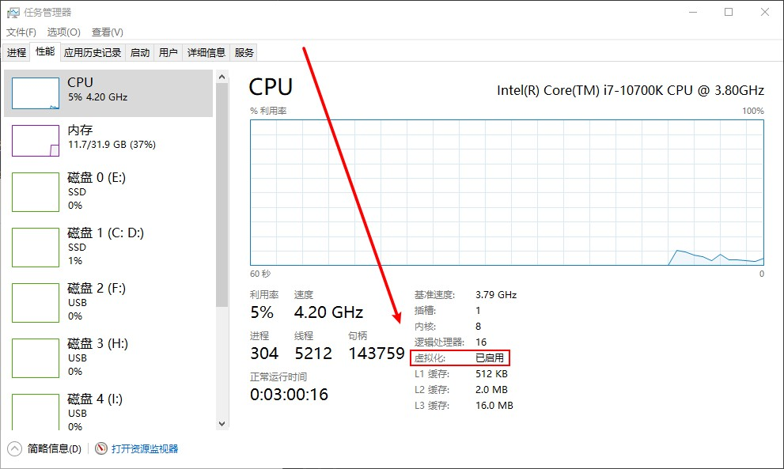
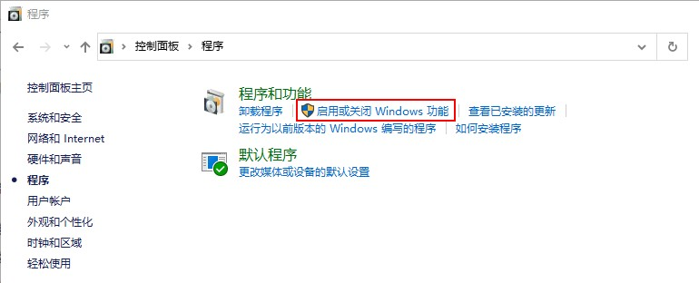
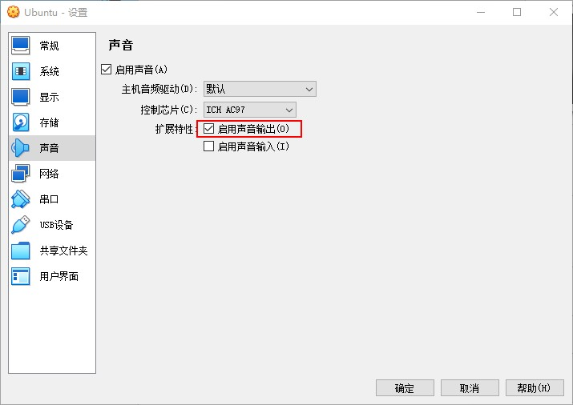

### prerequisite

> <font color="yellow"> 安装虚拟机前，需要进行的配置 </font>
> 
> **1. BIOS开启硬件虚拟化**
> 
> `AMD`的叫`SVM`，`Intel`的叫`VT-D`
> 
> > * AMD
> > > 华硕主板 ( 高级 -> CPU设置 -> SVM Mode )
> > > https://www.bilibili.com/video/BV18K411K7Mg
> > > 微星主板 ( OC -> CPU Features -> SVM Mode )
> > > https://blog.csdn.net/tsdss_/article/details/121574556
> 
> > * Intel
> > > 华硕主板 ( 高级 -> CPU设置 -> Intel(VMX)虚拟化技术 )
> > > https://www.bilibili.com/video/BV13S4y1p7L2
> > > 微星主板 ( OC -> CPU Features -> Intel VT-D Tech )
> > > https://www.bilibili.com/video/BV16t4y1e757
> 
> * 检查是否已经开启硬件虚拟化
> 任务管理器
> <div align=center>
> 
> </div>
>
> 
> **2. 关闭Hyper-V**
> 
> > Windows 操作系统中的 Hyper-V 技术与其他虚拟化技术（如 VirtualBox、VMware Workstation）有冲突，无法同时运行。这是由于这些虚拟化技术需要使用 CPU 的虚拟化扩展功能，而 Hyper-V 技术也需要使用相同的扩展功能。
> <div align=center>
> 
> 
> </div>
> 
>
> **3. 下载安装包**
> 
> * **VirtualBox**
> > https://www.virtualbox.org/wiki/Downloads
> > 
> > <div align=center>
> > 
> > </div>
> > 
> > `VirtualBox-7.0.8-156879-Win.exe`
> > `Oracle_VM_VirtualBox_Extension_Pack-7.0.8.vbox-extpack`
>
> * **Ubuntu20.04**
> > https://releases.ubuntu.com/20.04/
> > 
> > 先下载种子文件，若直接下载`iso`文件，很慢
> > <div align=center>
> > 
> > </div>
> > 
> > `ubuntu-20.04.6-desktop-amd64.iso.torrent`
> > `ubuntu-20.04.6-desktop-amd64.iso`
> 

### 安装并配置VirtualBox-7.0.8
>
> 安装：一路Next就可以了,这个比较简单。
> 
> 配置：
>
> `CTRL+G`打开全局设定，设置虚拟机默认安装位置
> <div align=center>
> 
> </div>
>
> 安装`VirtualBox Extension Pack`
> > 支持 USB 2.0 和 USB 3.0 设备, VirtualBox RDP, 磁盘加密，虚拟机快照等功能。
> 
>  工具 -> 扩展 -> 安装
> <div align=center>
> 
> 
> 
> 
> </div>
>
> 

### 创建虚拟机
>
> <div align=center>
> 
> 
> 
> 
> 
> 
> </div>
> 
### 设置虚拟机
>
> <div align=center>
> 
> 
> 
> 
> 
> 
> 
> </div>
> 


### 安装Ubuntu20.04 

> <div align=center>
> 
> 
> 
> 
> 
> 
> 
> 
> 
> 
> 
> </div>
> 
> Please remove the installation medium,then press ENTER，这是因为启动默认是从CD/DVD启动，所以才导致了这样的问题。
>
> **直接按下Enter键**
>
> <div align=center>
> 
> 
> 
> 
> </div>
>
 


### 安装增强功能
>
> `Oracle_VM_VirtualBox_Extension_Pack-7.0.8.vbox-extpack`
> 
> <div align=center>
> 
> 
> 
> 
> 
> 
> 
> 
> </div>
>
> 需要安装gcc, make, perl
> 
> ```bash
> $ sudo apt install gcc 
> $ sudo apt install make 
> $ sudo apt install perl
> ```
> 由于没有换源，可能要一段时间才能安装好
> 
> <div align=center>
> 
> 
> </div>
> 
>  重启
> 
> <div align=center>
> 
> </div>
>
> 可以全屏显示了
>
> 关机
>
> 移除虚拟盘
> 
> <div align=center>
> 
> </div>
>
> 


### 设置共享文件夹

> 启动虚拟机
>
> 然后，设置 -> 共享文件夹
>
> 
> <div align=center>
> 
> 
> 
> 
> </div>
>
> 点击确定后，打开虚拟机看看
> <div align=center>
> 
> </div>
> 
> 想要进去看，需要设置并输入管理员权限密码
> 还是`123456`
> 
> <div align=center>
> 
> </div>
> 
> 
> <font color="yellow"> 以后想要向虚拟机中传输文件，就可以先将文件放到`E:\VirtualBox_Files\vmshare`，然后进入虚拟机的`/home/zqc/vmshare`查看 </font>
>
> 


