#### 设置root密码、切换root用户

> * <font color="yellow"> 设置root密码 </font>
> 
> ```bash
> ### 设置root密码
> $ sudo passwd root
> ```
> <div align=center>
> 
> </div>
>
> 
> * <font color="yellow"> 切换root用户 </font>
>
> ```bash
> # 切换root用户
> $ sudo su 
> # 或者 $ su root
> # 或者 $ su – root
> 
> # 显示当前路径
> $ pwd 
>
> # 退出root用户
> $ exit 
> # 或者 Ctrl+D
> ```
> <div align=center>
> 
> </div>
>
> 
> * <font color="yellow"> 补充说明 </font>
> 
> > * `sudo` 意思就是 `super-user do`，让当前用户暂时以管理员的身份 `root` 来执行这条命令。 
> > * `su` 是用来改变当前用户。 
> > * `su root`，就是将当前用户切换为 `root`。用了 `su root` 之后，下面所有的命令就可以不用打 `sudo` 了，因为当前用户已经是管理员 `root` 了。
> > * `root` 用户为根用户，也就是 系统管理员。`root` 拥有全部权限。
>
> * <font color="yellow"> `sudo`执行命令的流程: </font>
> 
> > * 1、当前用户切换到`root`（或其他指定切换到的用户），
> > * 2、以`root`（或其他指定的切换到的用户）身份执行命令，
> > * 3、执行完成后，直接退回到当前用户，而这些的前提是要通过`sudo`的配置文件`/etc/sudoers`来进行授权。
> 
> 
> * <font color="yellow"> `su` 和 `sudo` 的区别 </font>
> 
> > * 共同点：都是`root`用户权限；
> > * 不同点：`su`只获得`root`权限，工作环境不变，还是在切换之前用户的工作环境；`sudo`是完全获得`root`的权限和`root`的工作环境。
>
> > 
> * <font color="yellow"> `su - root` 和 `su root` 区别 </font>
> 
> > * `su - root`：以`root`身份登录，then the shell is login shell, `.bash_profile` and `.bashrc` will be sourced.
> > * `su root`/其他命令：与`root`建立一个连接，通过`root`执行命令。then only `.bashrc` will be sourced.
> > * 最直接的区别是`su root`目录还是原先用户目录，`su - root`后目录就变为root用户的主目录。
> > 
> 

#### 如果想要修改用户密码、root密码
>
> <font color="yellow"> 修改用户密码 </font>
> 
> ```bash
> # 可能需要先进入root
> # sudo su 
> 
> # 修改用户密码
> # $ sudo passwd username # username：想要修改的用户名
> $ sudo passwd zqc
> ```
>
> 
> <font color="yellow"> 修改root密码 </font>
> 
> ```bash
> # 修改root密码
> $ sudo passwd root
> ```
>
> 


#### 换源并更新（图形界面方式）

> `Software & Updates` -> `Download from`
>
> 没选清华源的原因是，Choose后是`https://mirrors.tuna.tsinghua.edu.cn/ubuntu-ports`. `ubuntu-ports`是`arm`架构的，我的电脑无论是`AMD`还是`Intel`都是`x86`结构，需要`ubuntu`.即，需要`https://mirrors.tuna.tsinghua.edu.cn/ubuntu`，
> 
> <div align=center>
> 
> 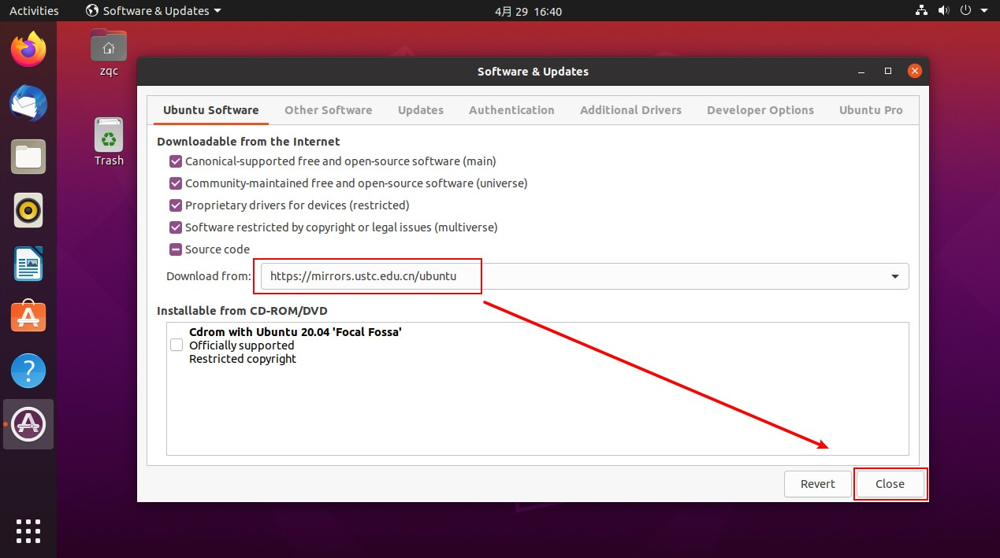
> 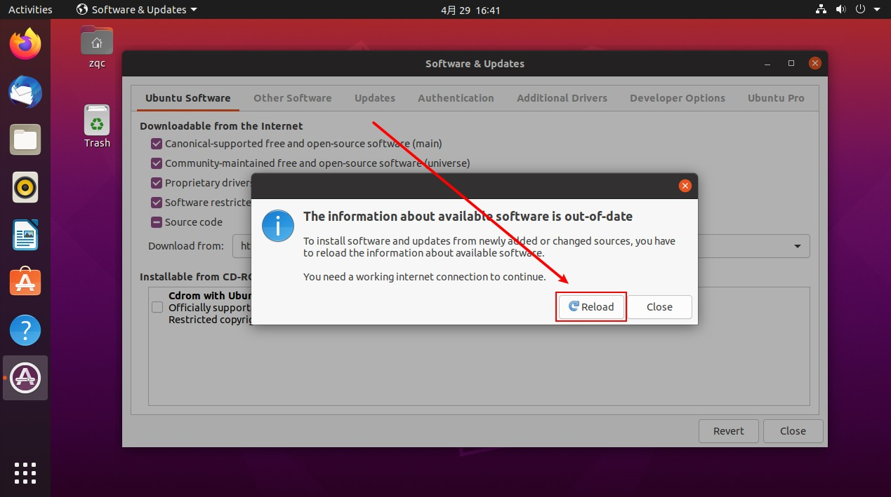
> 
> </div>
>
> ```bash
> $ sudo apt-get update
> $ sudo apt-get -f install
> $ sudo apt-get upgrade
> ```
>
> <div align=center>
> 
> 
> </div>
>

#### 使用全英文，我们不安装中文输入法了


#### 如何安装软件

> *我们可以通过`apt-cache search XXXX`来查找软件库中有没有我们想要安装的软件。比如我们想看看有没有常用的调试工具cgdb,就可以使用apt-cache search cgdb来查找：
> 
> Ubuntu中安装软件比较简单，使用`sudo apt-get install XXX`就可以安装`XXX`软件，比如我们常用的Vim,就可以用sudo apt-get install Vim来安装。
>
> **我们可以一次安装多个软件**，比如sudo apt-get install git ddd就会安装分布式版本控制工具git和图形化调试工具ddd
>

#### 写软件安装脚本

> **我们可以写个脚本简化软件的安装，你可以源源不断的把自己用的软件添加到这个脚本中，方便日后自己安装新系统**： 
>
> <font color="yellow"> 例如，`software_setup.sh`内容如下 </font>
> ```bash
> #!/bin/bash
> #这一行是表示使用 /bin/bash 作为脚本的解释器
> #这行要放在脚本的行首并且不要省略。
> 
> $ sudo apt-get install git
>
> $ sudo apt-get install vim
>
> ...
>
> ```
>
> 
> <font color="yellow"> 如何运行脚本？ </font>
> ```bash
> # 使用shell来执行
> sh software_setup.sh
> 
>
> # 使用bash来执行
> bash software_setup.sh
> 
>
> # 使用source来执行
> # bash 中的 source 命令用于在当前 bash 环境下读取并执行 FileName.sh 中的命令。
> source software_setup.sh
> 
>
> # 使用.来执行   等价于 source 命令
> . ./software_setup.sh
> 
>
> # 还可以赋予脚本所有者执行权限，允许该用户执行该脚本
> chmod u+rx software_setup.sh
> ./software_setup.sh
> ```
>
> 

#### 警惕，`sudo apt-get autoremove` 最好不使用

> https://blog.csdn.net/zhngyue123/article/details/106229346
>
> linux中的apt-get 命令为用户提供了一个用于下载和安装软件包的简易命令行界面，通过更新源自动下载所需要的依赖包，自动的解决安装包的依赖关系，搜索安装其他的依赖文件。这里简单介绍三个apt-get命令：
> ```html
> (1) remove – 卸载软件包
> (2) autoremove – 卸载所有自动安装且不再使用的软件包
> (3) purge – 卸载并清除软件包的配置  
> 
> 这里重点介绍一下autoremove： 
> apt-get autoremove 的行为重点是卸载所有自动安装，
> 例如：C 依赖于 B, D 依赖于B, 且D没有被其他手动安装的包依赖。
> apt-get remove C 将删除C, 同时提示你用apt-get autoremove去清除B,D ；
> apt-get autoremove C 将删除B, C, D 。
> 所以，这条命令最恐怖的是在不了解的情况下，你不知道他会把系统中的什么配置文件给删除.
> 
> ```
>


#### 安装pip
>
> ```bash
> $ pip
> ```
>
> <div align=center>
> 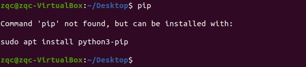
> </div>
>
> 
> ```bash
> $ sudo apt install python3-pip
> ```
>
> <div align=center>
> 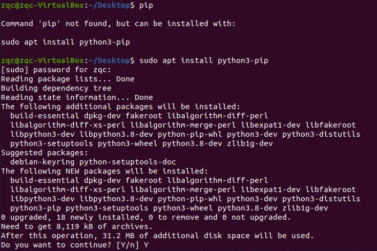
> </div>
>


####  安装git
>
> ```bash
> $ git
> ```
>
> <div align=center>
> 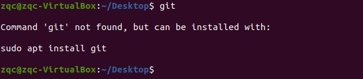
> </div>
>
> 
> ```bash
> $ sudo apt install git
> ```
>
> <div align=center>
> 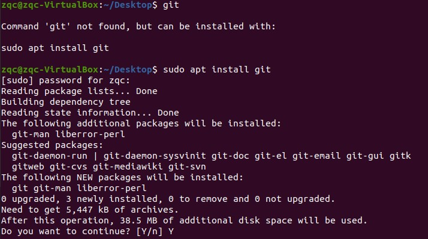
> </div>
>

####  安装net-tools

>
> ```bash
> $ ifconfig
> ```
>
> <div align=center>
> 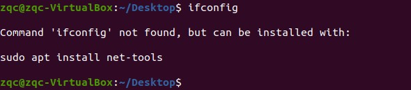
> </div>
>
> 
> ```bash
> $ sudo apt install net-tools
> ```
>
> <div align=center>
> 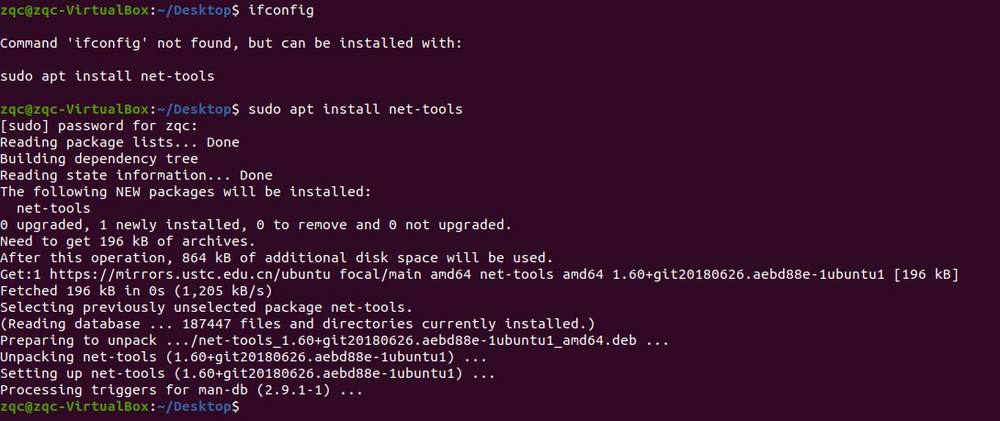
> </div>
>


#### 校准时间:

> 1. 设置网络时间协议 NTP
> 
> ```bash
> $ sudo apt-get install -y chrony ntpdate
> 
> $ sudo ntpdate -q ntp.ubuntu.com
> ```
>
> 2. 运行
> 
> ```bash
> $ date -R  # 查看最后的时区, 正常的+0800说明已经是东八区
> ```
> 
> <div align=center>
> 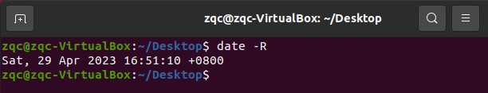
> </div>
>


#### 虚拟机通过win10的vpn上网

> <font color="yellow"> 方法一（这样只能是访问github，其他网站不好使） </font>
> 
> 虚拟机双网卡设置。
> 第一个网卡设置为Host-Only模式，保证主机和虚拟机在同一个IP段；
> 第二个网卡设置为NAT模式，利用主机的上网功能来联网
> 
> <div align=center>
> 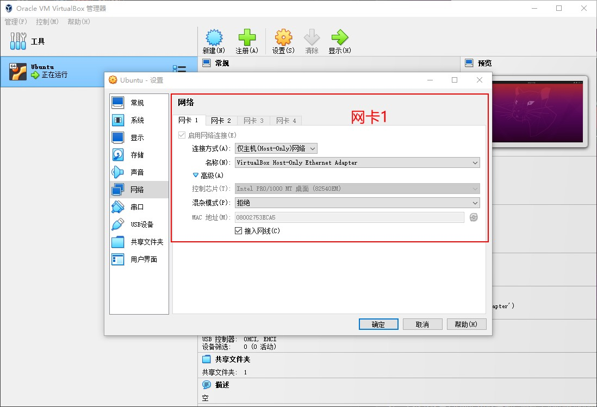
> 
> </div>
>
> 
> <font color="yellow"> 方法二（对于使用Clash翻墙的可以用） </font>
>
> 1. Clash允许局域网连接
> 打开电脑Clash for Windows 的 Allow LAN 开关，然后鼠标悬浮在上这个选项上，底部会显示IP地址。
> 
> <div align=center>
> 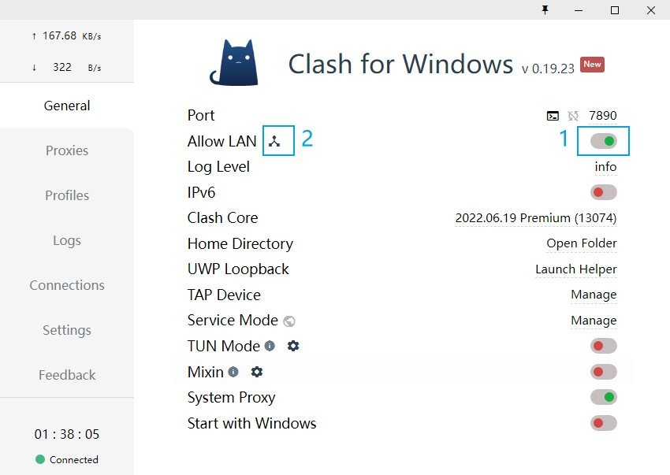
> 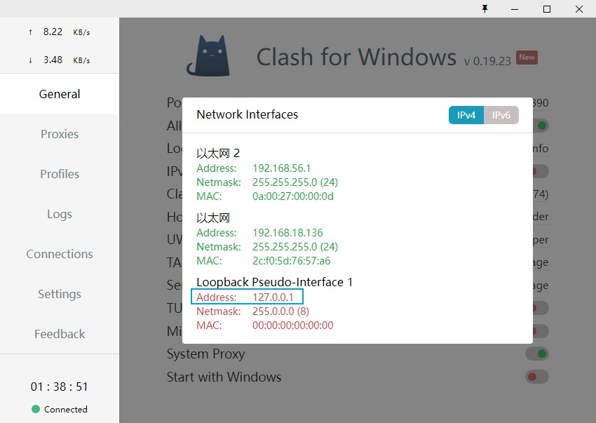
> </div>
>
> clash会放出一个ip地址 `127.0.0.1:7890`
>
> 2. 查看windows的ip地址 `192.168.18.136`
> 
> <div align=center>
> 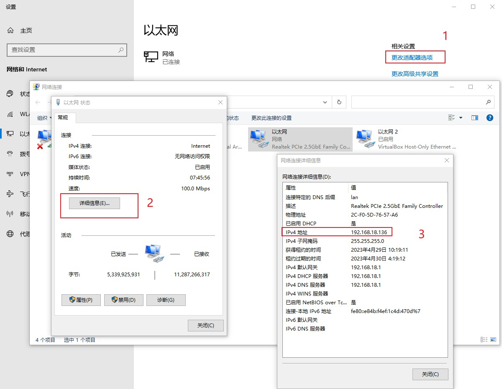
> </div>
>
> 
> 3. VirtualBox 选择桥接模式
> 
> <div align=center>
> 
> </div>
>
> 4. 进入虚拟机，ping一下当前主机的ip
>
> <div align=center>
> 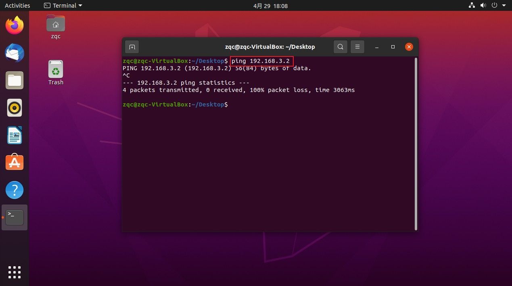
> </div>
>
> 虽然没ping通，但是不影响
> 
> 5. linux里打开代理输入这个ip就连接成功了 `192.168.18.136:7890`
>
> <div align=center>
> 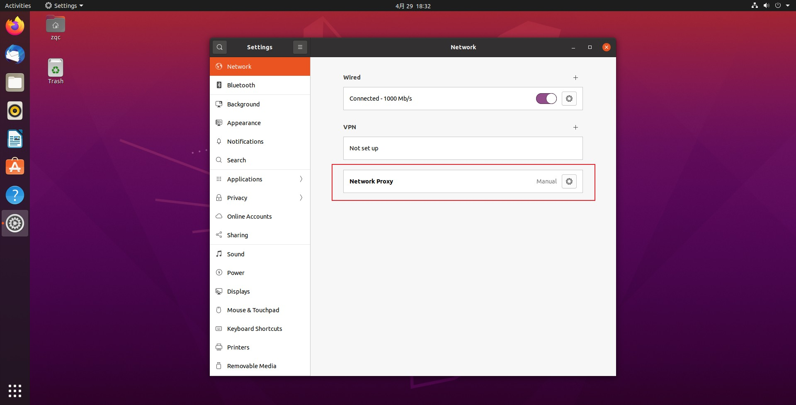
> 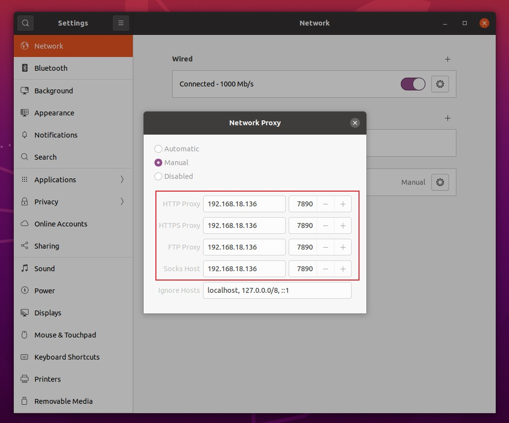
> </div>
>

#### 若以上都不行，就下载Linux版本的Clash

> 直接在虚拟机里面装了一遍Linux版的clash，可以翻墙
> 
> 


