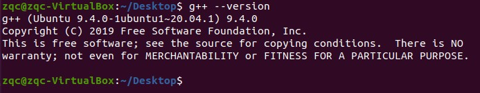
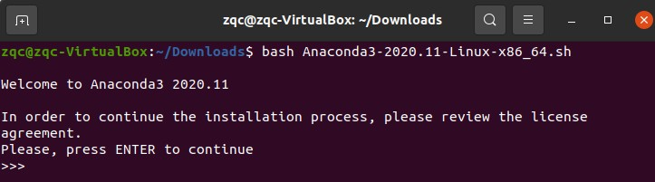
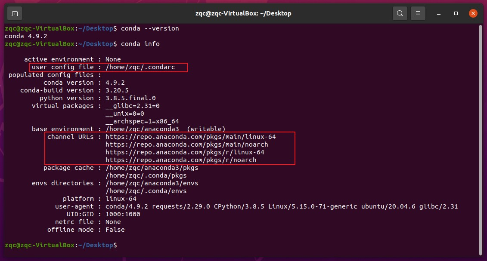

### Bosch 实习时的设置

> Ubuntu 20.04
> 环境：g++-8、gcc-8、cmake-3.22.0、python3.8、ROS-neotic、conan-1.56.0
> 软件：VScode

> **第一步 gcc、g++**
>
> <font color="yellow">g++、gcc版本降级（9→8），采用如下方法：</font>
> https://zhuanlan.zhihu.com/p/453542931
> 
> **gcc**
> 
> 查看版本
> ```bash
> $ gcc --version
> ```
>
> <div align=center>
> 
> </div>
>
> Ubuntu20.04 自带gcc-9，需要降级到8
> 
> * 通过命令查询本机gcc已安装的版本, 发现只有gcc-9
> ```bash
> $ ls /usr/bin/gcc*
> ```
> * 输入命令，查看gcc-8可选的版本，可以看到候选
> ```bash
> $ sudo apt-cache policy gcc-8
> ```
> <div align=center>
> 
> </div>
>
> * 选择其中一个版本进行安装
> ```bash
> $ sudo apt-get install gcc-8=8.4.0-3ubuntu2
> ```
> <div align=center>
> 
> </div>
>
> * 再次查询本机gcc已安装的版本, 发现有gcc-8、gcc-9
> ```bash
> $ ls /usr/bin/gcc*
> ```
> <div align=center>
> 
> </div>
>
> * 改gcc-8成为默认版本
> ```bash
> # 配置优先级
> $ sudo update-alternatives --install /usr/bin/gcc gcc /usr/bin/gcc-8 80
> $ sudo update-alternatives --install /usr/bin/gcc gcc /usr/bin/gcc-9 90
> # 查看优先级，选择版本
> $ sudo update-alternatives --config gcc
> # 选择gcc-8对应的编号1 回车即可
> 
> # 查看版本
> $ gcc --version
> ```
> 
> <div align=center>
> 
> </div>
>
> <br>
> <br>
> <br>
> 
> **g++** 方法同上
> 
> 查看版本
> ```bash
> $ g++ --version
> ```
>
> <div align=center>
> 
> </div>
>
> Ubuntu20.04 自带g++-9，需要降级到8
> 没有g++-9的话，就按照提示安装g++-9
> 
> * 通过命令查询本机g++已安装的版本, 发现只有g++-9
> ```bash
> $ ls /usr/bin/g++*
> ```
> * 输入命令，查看g++-8可选的版本，可以看到候选
> ```bash
> $ sudo apt-cache policy g++-8
> ```
> <div align=center>
> 
> </div>
>
> * 选择其中一个版本进行安装
> ```bash
> $ sudo apt-get install g++-8=8.4.0-3ubuntu2
> ```
> <div align=center>
> 
> </div>
>
> * 再次查询本机g++已安装的版本, 发现有g++-8、g++-9
> ```bash
> $ ls /usr/bin/g++*
> ```
> <div align=center>
> 
> </div>
>
> * 改g++-8成为默认版本
> ```bash
> # 配置优先级
> $ sudo update-alternatives --install /usr/bin/g++ g++ /usr/bin/g++-8 80
> $ sudo update-alternatives --install /usr/bin/g++ g++ /usr/bin/g++-9 90
> # 查看优先级，选择版本
> $ sudo update-alternatives --config g++
> # 选择g++-8对应的编号1 回车即可
> 
> # 查看版本
> $ g++ --version
> ```
> 
> <div align=center>
> 
> </div>
>


> **第二步 CMake**
>
> ```bash
> cmake --version
> ```
> 
> <div align=center>
> 
> </div>
>
> <br>
> <br>
> <br>
>  
> <font color="yellow">cmake安装，方法1(未成功)：</font>
> ```bash
> pip install cmake==3.22.0
> ```
>
> <div align=center>
> 
> </div>
> 
> `WARNING: The scripts cmake, cpack and ctest are installed in '/home/zqc/.local/bin' which is not on PATH`
> "没有将环境变量添加到路径"，如果忽略这个警告，后续可能会出现无法导入包等情形
>
> 先卸载刚才进行的安装：
> ```bash
> $ pip uninstall cmake==3.22.0
> ```
> 
> ```bash
> cmake --version
> ```
> 
> <div align=center>
> 
> </div>
>
> <br>
> <br>
> <br>
> 
> <font color="yellow">cmake安装，方法2：</font>
>
> cmake官网
> https://cmake.org/download/
> 
> <div align=center>
> 
> </div>
>
> github仓库
> https://github.com/Kitware/CMake/releases
> 翻到第5页
> https://github.com/Kitware/CMake/releases?page=5
> 
> <div align=center>
> 
> </div>
> 
> `v3.22.0`的github链接为：
> `https://github.com/Kitware/CMake/releases/download/v3.22.0/cmake-3.22.0-linux-x86_64.tar.gz`
> 
> 1、首先下载cmake压缩包，然后再建立软链接覆盖系统原来的cmake。
> ```bash
> # 进入到下载目录下，其他目录也可以
> $ cd ~/Downloads 
> 
> # 下载cmake源码包
> # 这个不是仓库，没法用git clone
> # 使用wget
> $ wget https://github.com/Kitware/CMake/releases/download/v3.22.0/cmake-3.22.0-linux-x86_64.tar.gz
> 
> # 网速可能比较慢，要等挺久
> # 不行的话，就按照下面这样做
> # 先在win10下载好，通过共享文件夹`E:\VirtualBox_Files\vmshare`加入虚拟机的`/home/zqc/vmshare`中
> 
>  
> # 解压
> $ sudo tar -xzvf cmake-3.22.0-linux-x86_64.tar.gz
> 
> # 将解压出来的包移到 /opt 目录下
> $ sudo mv cmake-3.22.0-linux-x86_64 /opt/cmake-3.22.0  
> 
> # 建立软链接
> $ sudo ln -sf /opt/cmake-3.22.0/bin/* /usr/bin/   
> 
> # 查看是否成功
> $ cmake --version
> 
> # 显示 cmake version 3.22.0
> ```
> 
> <div align=center>
> 
> </div>
> 
> 2、cmake安装成功之后，不要忘记将cmake的文件路径添加至 .bashrc里面：
> ```bash
> # 进入~/.bashrc
> $ sudo gedit ~/.bashrc
> 
> # 输入以下内容
> export PATH=$PATH:/opt/cmake-3.22.0/bin
>
> # 保存 .bashrc的更改并退出
> ```
> 
> <div align=center>
> 
> </div>
> 
> 3、更新source
> ```bash
> $ source ~/.bashrc 
> ```
> 

> **第三步 Python3.8**
> 
> <font color="yellow"> python无效？ </font>
> Ubuntu20.04中已经安装了Python3，但是输入`python`指令时，收到提醒
> ```bash
> $ python
> 
> Command 'python' not found, did you mean:
> 
>   command 'python3' from deb python3
>   command 'python' from deb python-is-python3
> ```
> 但输入 python3 是不会报错的
> ```bash
> $ python3
> Python 3.8.10 (default, Sep 28 2021, 16:10:42) 
> [GCC 9.3.0] on linux
> Type "help", "copyright", "credits" or "license" for more information.
> >>>
> ```
> 解决方式
> 安裝 python-is-python3，指令如下
> ```bash
> $ sudo apt install python-is-python3
> ```
> 还原只需要移除 python-is-python3，移除指令如下
> ```bash
> $ sudo apt remove python-is-python3
> ```
>
> 
> <div align=center>
> 
> </div>
> 


> **第四步 ROS**
> 
> ROS-noetic(对应Ubuntu20.04)
> 
> 官方教程：`https://wiki.ros.org/noetic/Installation/Ubuntu`
> 官方中文教程：`https://wiki.ros.org/cn/noetic/Installation/Ubuntu`
>
> 1. 注意：`Software & Updates` -> `Ubuntu Software` -> 勾选关键字`universe`, `restricted`, `multiverse`三项。
>
> <div align=center>
> 
> </div>
>
> 2. 设置sources.list, 添加ROS软件源
>
> 官方教程：`https://wiki.ros.org/ROS/Installation/UbuntuMirrors`
> 
> 命令行如下
> 
> ```bash
> sudo sh -c '. /etc/lsb-release && echo "deb http://mirrors.ustc.edu.cn/ros/ubuntu/ `lsb_release -cs` main" > /etc/apt/sources.list.d/ros-latest.list'
> ```
>
> 查看是否创建文件并且写入软件源
> ```bash
> cat /etc/apt/sources.list.d/ros-latest.list
> ```
> 显示`deb http://mirrors.ustc.edu.cn/ros/ubuntu/ focal main`
>
> 3. 为了从ROS存储库下载功能包，添加公钥
>
> ```bash
> $ sudo apt install curl # if you haven't already installed curl
> 
> $ curl -sSL 'http://keyserver.ubuntu.com/pks/lookup?op=get&search=0xC1CF6E31E6BADE8868B172B4F42ED6FBAB17C654' | sudo apt-key add -
> ```
>
> 4. 更新软件包索引
> 
> ```bash
> $ sudo apt-get update
>
> $ sudo apt-get upgrade -y
> ```
>
> 5. 安装ROS noetic
> 
> ```bash
> $ sudo apt install ros-noetic-desktop-full
> ```
>
> 6. 把"`source /opt/ros/kinetic/setup.bash`"追加到.bashrc文件后面，目的是每打开一个terminal时，系统会自动把ros环境刷新上。
>
> ```bash
> $ echo "source /opt/ros/noetic/setup.bash" >> ~/.bashrc
> 
> $ source ~/.bashrc
> ```
>
> 7. 安装构建ROS packages的依赖项
>
> ```bash
> $ sudo apt install python3-rosdep python3-rosinstall python3-rosinstall-generator python3-wstool build-essential
> ```
>
> 8. 初始化rosdep
>
> ```bash
> # 将官方的20-default.list 下载下来，放入/etc/ros/rosdep/sources.list.d/目录下
> $ sudo rosdep init  
> 
> # 从上述下载下的文件中读取目录下载更新.cache文件
> $ rosdep update
> ```
>
> 9. 启动roscore试试
>
> ```bash
> $ roscore
> ```
>
> <div align=center>
> 
> </div>
>

> 
> **若ROS 初始化失败怎么办**
>
> 检查虚拟机是否可以翻墙成功
>
> 如果实在不行，看下面这个博客
> 
> `https://blog.csdn.net/qq_30267617/article/details/115028689`
>
> 


> **第五步 conan**
>
> ```bash
> pip install conan==1.56.0 ### 1.45.0好像不行，德秀和飞扬用的是1.56.0
> ```
>
> 有Warning
> ```bash
> WARNING: The scripts conan, conan_build_info and conan_server are installed in '/home/zqc/.local/bin' which is not on PATH.
> Consider adding this directory to PATH or, if you prefer to suppress this warning, use --no-warn-script-location.
> ```
> 安装位置'/home/zqc/.local/bin'不在环境变量$PATH中
>
> 我们可以添加进去
> ```bash
> echo 'export PATH=$PATH:/home/zqc/.local/bin' >> ~/.bashrc
> ```  


#### 下载Chrome

> 打开Firefox浏览器
> 
> 输入网址`https://www.google.com/chrome/?platform=linux`
>
> <div align=center>
> 
> 
> </div>
>
> 右击`Open With Software Install`
>
> <div align=center>
> 
> 
> </div>
>


#### 安装VScode

> `https://code.visualstudio.com/docs/setup/linux`
> 
> <div align=center>
> 
> </div>
>
> ```bash
> $ wget --version
> 
> $ gpg --version
> ```
> `wget`和`gpg`都已经安装好
>
> ```bash
> $ wget -qO- https://packages.microsoft.com/keys/microsoft.asc | gpg --dearmor > packages.microsoft.gpg
> 
> $ sudo install -D -o root -g root -m 644 packages.microsoft.gpg /etc/apt/keyrings/packages.microsoft.gpg
> 
> $ sudo sh -c 'echo "deb [arch=amd64,arm64,armhf signed-by=/etc/apt/keyrings/packages.microsoft.gpg] https://packages.microsoft.com/repos/code stable main" > /etc/apt/sources.list.d/vscode.list'
> 
> $ rm -f packages.microsoft.gpg
> 
> $ sudo apt install apt-transport-https
> 
> $ sudo apt update
> 
> $ sudo apt install code          # or code-insiders
> 
> ```
> 安装完成
> ```bash
> $ code --version
> ```
> 显示如下
> ```html
> zqc@zqc-VirtualBox:~/Desktop$ code --version
> 1.77.3
> 704ed70d4fd1c6bd6342c436f1ede30d1cff4710
> x64
> ```


#### 安装截图软件Flameshot（没实际做，windows有Snipaste）

> 1. 安装
> 
> ```bash
> $ sudo apt-get install flameshot 
> ```
>
> 2. 设置快捷键
> 
> `Settings` -> `Keyboard Shortcuts`
> 
> `Command` 行输入 `flameshot gui`
> 
> <div align=center>
> 
> </div>
>


#### 安装Anaconda

> 下载前，`python`命令显示是这样
> 
> <div align=center>
> 
> </div>
>

> USTC的文档
> `http://mirrors.ustc.edu.cn/help/anaconda.html`
> 
> <div align=center>
> 
> </div>
>


> Ubuntu20.04是2020年4月23日发布的
> 
> 我们要选取之后发布的Anaconda安装包
> 
> 1. 下载Anaconda3-2020.11安装包(实际上是`.sh`脚本)
>
> 在虚拟机的浏览器中打开网址`https://mirrors.ustc.edu.cn/anaconda/archive/` 
>
> 下载`Anaconda3-2020.11-Linux-x86_64.sh`
> 
> <div align=center>
> 
> 
> </div>
>
> 在Terminal中执行以下命令：
> ```bash
> $ bash Anaconda3-2020.11-Linux-x86_64.sh
> ```
>
> 接下来**根据提示输入完成安装：**
> 
> * 按下Enter回车键，开始安装
> > <div align=center>
> > 
> > </div>
> 
> * 阅读注册信息，比较长，需要多次按下Enter回车键
> > <div align=center>
> > 
> > </div>
>
> * 输入yes
> > <div align=center>
> > 
> > </div>
>
> * 确认安装位置 /home/zqc/anaconda3，也可以自定义；
> > 我们不更改， 按下Enter回车键，开始安装
> > <div align=center>
> > 
> > </div>
>
> * 等待安装
> > <div align=center>
> > 
> > </div>
> 
> * 选择是否进行Anaconda的初始化，这个初始化是添加环境变量。
> > 输入“yes”选择添加环境变量；
> > <div align=center>
> > 
> > </div>
> 
> * 安装完成
> > <div align=center>
> > 
> > </div>
> 
> * 查看一下环境变量：
> > ```bash
> > $ sudo gedit ~/.bashrc
> > ```
> > <div align=center>
> > 
> > </div>
> 
> * 重新打开终端，验证安装是否成功
> > ```bash
> > $ conda --version
> > 
> > $ conda info        # 查看当前conda环境的信息
> > ```
> > <div align=center>
> > 
> > </div>
> 
> * 去除终端出现的(base)字样
> > 
> > 每次打开终端，左上角都会多了（base）字样
> > 不能让默认进入base环境，因为后面我们还要创建更多虚拟环境呢！
> > 可以通过修改conda的配置来实现永久更改。
> > 
> > ```bash
> > $ sudo gedit ~/.bashrc
> > ```
> > <div align=center>
> > 
> > </div>
> > 
> > 我们找到了问题的源头，那就是anaconda自动加入了命令到 .bashrc中。
> > 在我们打开终端的时候自动执行了`/home/zqc/anaconda3/etc/profile.d/conda.sh`文件，
> > 
> > 注释掉这一整段，换成`export PATH=$PATH:/home/zqc/anaconda3/bin`
> > <div align=center>
> > 
> > </div>
> > 
> > ```bash
> > $ conda --version
> > 
> > $ conda info        # 查看当前conda环境的信息
> > ```
> > 可以看到`active environment : None`，并未激活环境
> > <div align=center>
> > 
> > </div>
> > 


> **有一个问题**
> 
> > * 如果`~/.bashrc`中加入的是
> > `export PATH="/home/zqc/anaconda3/bin:$PATH"`
> > 则运行 `python`显示的和之前不一样
> > <div align=center>
> > 
> > 
> > </div>
> > 
> > * 如果`~/.bashrc`中加入的是
> > `export PATH=$PATH:/home/zqc/anaconda3/bin`
> > 则运行 `python`显示的和之前相同
> > <div align=center>
> > 
> > 
> > </div>
> > 
> 

> <font color="yellow"> 修改conda源 </font>
>
> 从`$ conda info`显示的信息中，我们知道
> `channel URLs`未改为国内的源
> > <div align=center>
> > 
> > </div>
> > 
>
> 清华源内容如下
> `https://mirrors.tuna.tsinghua.edu.cn/help/anaconda/`
> > 
> > ```html
> > channels:
> >   - defaults
> > show_channel_urls: true
> > default_channels:
> >   - https://mirrors.tuna.tsinghua.edu.cn/anaconda/pkgs/main
> >   - https://mirrors.tuna.tsinghua.edu.cn/anaconda/pkgs/r
> >   - https://mirrors.tuna.tsinghua.edu.cn/anaconda/pkgs/msys2
> > custom_channels:
> >   conda-forge: https://mirrors.tuna.tsinghua.edu.cn/anaconda/cloud
> >   msys2: https://mirrors.tuna.tsinghua.edu.cn/anaconda/cloud
> >   bioconda: https://mirrors.tuna.tsinghua.edu.cn/anaconda/cloud
> >   menpo: https://mirrors.tuna.tsinghua.edu.cn/anaconda/cloud
> >   pytorch: https://mirrors.tuna.tsinghua.edu.cn/anaconda/cloud
> >   pytorch-lts: https://mirrors.tuna.tsinghua.edu.cn/anaconda/cloud
> >   simpleitk: https://mirrors.tuna.tsinghua.edu.cn/anaconda/cloud
> > ```
> 
> 中科大内容如下
> `http://mirrors.ustc.edu.cn/help/anaconda.html`
> 但是网页提示：`由于合规性，Anaconda 源目前已经无限期停止服务`
> > ```html
> > channels:
> >   - defaults
> > show_channel_urls: true
> > default_channels:
> >   - https://mirrors.ustc.edu.cn/anaconda/pkgs/free/
> >   - https://mirrors.ustc.edu.cn/anaconda/pkgs/main/
> > custom_channels:
> >   conda-forge: https://mirrors.ustc.edu.cn/anaconda/cloud/conda-forge/
> >   msys2: https://mirrors.ustc.edu.cn/anaconda/cloud/msys2/
> >   bioconda: https://mirrors.ustc.edu.cn/anaconda/cloud/bioconda/
> >   menpo: https://mirrors.ustc.edu.cn/anaconda/cloud/menpo/
> > ```
>
> 
> <font color="yellow"> 我们还是采用清华源吧 </font>
>
> `https://mirrors.tuna.tsinghua.edu.cn/help/anaconda/`
> 
> 修改`user config file : /home/zqc/.condarc`
> > ```bash
> > $ sudo gedit ~/.condarc
> > ```
> > 
> > <div align=center>
> > 
> > </div>
> > 
> > 注：show_channel_urls：true #设置搜索时显示通道地址
>
> 运行 `conda clean -i` 清除索引缓存，保证用的是镜像站提供的索引。
> > ```bash
> > $ conda clean -i
> > ```
> > 
>
> 查看现在用的是哪些源
> > ```bash
> > $ conda config --show-sources  # 显示~/.condarc中的所有内容
> > 
> > $ conda config --show channels # 只显示~/.condarc中的channels中的内容
> > ```
> > 
> > <div align=center>
> > 
> > </div>
> > 
> 
> 补充说明
> > `https://blog.csdn.net/weixin_39487353/article/details/104666953`
> > 
> > `.condarc`一般表示`conda`的配置文件，在用户的`home`目录（`windows：C:\\users\\username\\`，`linux：/home/username/`）。
> > 但对于`.condarc`配置文件，是一种可选的（optional）运行期配置文件，其默认情况下是不存在的，但当用户第一次运行 `conda config` 命令时，将会在用户的`home`目录创建该文件
>
> 


#### 创建虚拟环境（以yolov5为例）

> 见`Old_Notes/Ubuntu_setup_note.docx`
