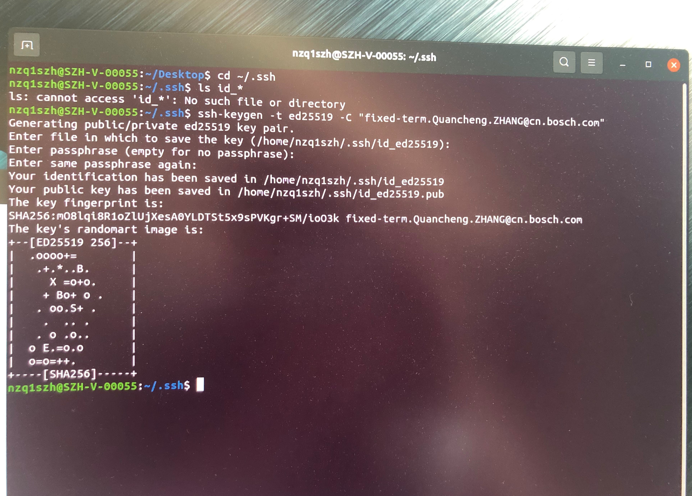
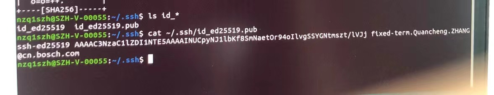

#### Bosch 实习时记录的

> <font color="yellow">Creating an SSH key on Linux & maxOS</font>
> 1. Check for existing SSH keys
> > 打开Terminal，输入
> > ```bash
> > cd ~/.ssh
> > ```
> > 检查是否已经有key
> > ```bash
> > ls id_*
> > ```
> > 若显示如下：
> > ```bash
> > ls: cannot access 'id_*': No such file or directory. 
> > ```
> > 跳转到 3.  Generate a new key
>
> 2. Back up old SSH keys (备份原有密钥)
> > 若已有密钥，但是不想用来链接到 Bitbucket Server， 则应备份这些密钥
> > 在Terminal中，运行
> > ```bash
> > mkdir key_backup
> > cp id_ed25519* key_backup <!--Ed25519类型--> 
> > cp id_ras* key_backup     <!--RSA2类型--> 
> > ```
>
> 3. Generate a new key
> > 如果没有密钥，按如下方式生成一个
> > 在Terminal中，运行
> > ```bash
> > # ssh-keygen -t ed25519 -C "your_email@example.com"
> > ssh-keygen -t ed25519 -C "fixed-terms.Quancheng.ZHANG@cn.bosch.com"
> > ```
> > 将密钥与电子邮件关联，有助于以后识别密钥
> > 命令运行后显示如下：
> > ```bash
> > nzq1szh@SZH-V-00055:~/.ssh$ ssh-keygen -t ed25519 "fixed-terms.Quancheng.ZHANG@cn.bosch.com"
> > Generating public/private ed25519 key pair.
> > Enter file in which to save the key (/home/nzq1szh/.ssh/id_ed25519):
> > ```
> > 只需要按下Enter，即可接受默认位置和文件名。如果.ssh目录不存在，系统会创建一个
> > 按下Enter后显示如下：
> > ```bash
> > nzq1szh@SZH-V-00055:~/.ssh$ ssh-keygen -t ed25519 "fixed-terms.Quancheng.ZHANG@cn.bosch.com"
> > Generating public/private ed25519 key pair.
> > Enter file in which to save the key (/home/nzq1szh/.ssh/id_ed25519):
> > Enter passphrase (empty for no passphrase):
> > ```
> > 再次按下Enter，（不输入密码短语，empty就行）显示如下：
> > ```bash
> > nzq1szh@SZH-V-00055:~/.ssh$ ssh-keygen -t ed25519 "fixed-terms.Quancheng.ZHANG@cn.bosch.com"
> > Generating public/private ed25519 key pair.
> > Enter file in which to save the key (/home/nzq1szh/.ssh/id_ed25519)
> > Enter passphrase (empty for no passphrase)
> > Enter same passphrase again:
> > ```
> > 再次按下Enter，显示如下：
> > ```bash
> > nzq1szh@SZH-V-00055:~/.ssh$ ssh-keygen -t ed25519 "fixed-terms.Quancheng.ZHANG@cn.bosch.com"
> > Generating public/private ed25519 key pair.
> > Enter file in which to save the key (/home/nzq1szh/.ssh/id_ed25519)
> > Enter passphrase (empty for no passphrase)
> > Enter same passphrase again:
> > Your identification has been saved in /home/nzq1szh/.ssh/id_ed25519
> > Your public key has been saved in /home/nzq1szh/.ssh/id_ed25519.pub
> > The key fingerprint is:
> > SHA256:m08lqi8R1oZlUjXesA0YLDTSt5x9sPVKgr+SM/io03k fixed-terms.Quancheng.ZHANG@cn.bosch.com
> > The key's randomart image is:
> > ...
> > ```
>
> <div align=center>
> 
> </div>
> 
> 4. 获取密钥
> > 终端中输入
> > ```bash
> > nzq1szh@SZH-V-00055:~/.ssh$ ls id_*
> > id_ed2519  id_ed2519.pub
> > 
> > nzq1szh@SZH-V-00055:~/.ssh$ cat ~/.ssh/id_ed25519.pub
> > ssh-ed25519 AAAAC3NzaC1lZDI1NTE5AAAAINUCpyNJ1lbKf8SmNaet0r94oIlvgSSYGNtmszt/lVJj fixed-terms.Quancheng.ZHANG@cn.bosch.com
> > ```
> <div align=center>
> 
> </div>
>
> 即密钥为
> > ```bash
> > ssh-ed25519 AAAAC3NzaC1lZDI1NTE5AAAAINUCpyNJ1lbKf8SmNaet0r94oIlvgSSYGNtmszt/lVJj fixed-terms.Quancheng.ZHANG@cn.bosch.com
> > ```
